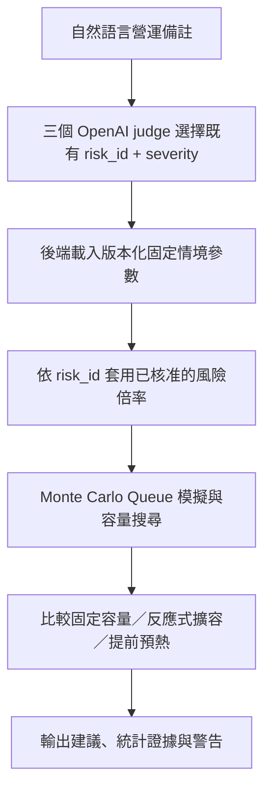

# OpeningGuard AI

17 分鐘細節說明影片：[Google Drive](https://drive.google.com/drive/folders/1NM3f9mzyHOnzwUEiZXl1QuIa8OiDY9Il)

## 要解決的問題

基於前一天的交易資料、新聞等營運訊號，用 LLM 分析並預測隔日開盤流量，讓工程團隊能提前預熱容量，避免開盤尖峰把系統沖垮。

## 架構

前後端分離。核心流程是 Agent 風險判斷 → 固定參數模擬 → 容量策略比較（細節見 [`backend/docs/後端.md`](backend/docs/後端.md#3-系統流程)）：



Agent 只做風險分類與 `risk_id`/`severity` 選擇（工具調用層），不產生 RPS、倍率或容量數字；數值計算全由可重現的 Python 模擬器完成，避免 LLM 幻覺直接控制容量。三 judge 無多數共識時，`agent_severity=uncertain` 且 `requires_human_review=true`，另以 `simulation_assumption=high` 做最壞情境預覽（不覆寫正式判斷）。

- **`backend/`** — 已可執行的 FastAPI 服務。合成流量 Monte Carlo 模擬 + 三個 OpenAI judge 從固定風險目錄選 `risk_id`/`severity` + 三種容量策略（固定／反應式／預測式預熱）比較。完整技術設計、假設與限制見 [`backend/README.md`](backend/README.md) 與 [`backend/docs/後端.md`](backend/docs/後端.md)，接手前必讀。

## 快速開始

### 後端

```bash
cd backend
uv sync
uv run fastapi dev main.py
```
