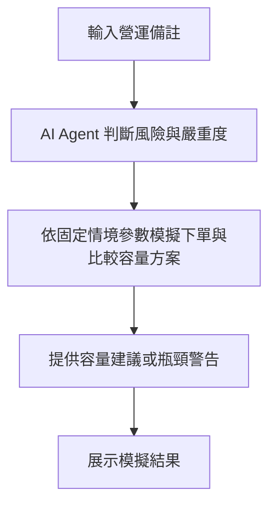

# OpeningGuard AI 後端

## 專案目的

OpeningGuard AI 是券商內部使用的開盤容量決策 Demo。系統以合成下單請求建立 Monte Carlo 排隊模擬，比較固定容量、反應式 autoscaling 與預測式預熱，並以人工標註 few-shot 範例引導單次 OpenAI Agent 從固定風險目錄選擇 `risk_id` 與容量影響 `severity`，再交由確定性的容量評估工具計算。

本專案回答兩個問題：

1. 開盤尖峰發生時，提前預熱是否能比反應式擴容更早控制 Queue 與延遲？
2. 當 Database 或交易閘道已成為硬上限時，為什麼繼續增加 worker 仍無法解決壅塞？

所有 RPS、容量與成本都是 **Synthetic Demo Assumption**，不代表任何券商真實數據。系統不連接真實下單服務，也不會真的修改基礎設施；Demo 只產生容量建議。

完整的產品需求、Agent 邊界、統計假設與評審問題整理於 [`docs/後端.md`](docs/後端.md)。新的同預算事件實驗定義、資訊隔離與可宣稱範圍整理於 [`docs/同預算事件實驗.md`](docs/同預算事件實驗.md)。

## 系統流程圖



模擬比較「固定容量、反應式擴容、提前預熱」三種策略。Agent 負責判斷風險；後端使用版本化的固定參數計算容量、延遲與成本。

## 技術架構

| 項目 | 現行設定 | 用途 |
|---|---|---|
| Python | `>=3.13` | 模擬器、API 與 Agent |
| 套件管理 | `uv`、`pyproject.toml`、`uv.lock` | 建立可重現環境與鎖定依賴 |
| API | FastAPI | 提供 health check 與容量模擬端點 |
| 數值計算 | NumPy | 合成流量與 Monte Carlo 統計 |
| Agent | OpenAI Responses API strict function calling | 參考人工標註範例，單次判斷風險與容量影響程度 |
| Schema | Pydantic | 驗證 API 輸入 |
| 統計分析 | pandas、Matplotlib、Seaborn、JupyterLab | 產生表格、信賴區間與敏感度圖 |
| 儲存 | JSON 與記憶體 | MVP 情境、風險目錄及執行結果；目前無正式 Database |

## 現行模擬模型

### 1. 時間與 Queue

- 模擬期間為開盤後 300 秒。
- 時間步長為 $\Delta t=0.1$ 秒。
- 相同 100 ms 內的請求以 cohort 彙整，進入單一 FIFO Queue。
- Queue 滿時，超出容量的 attempts 記為失敗。
- 客戶端逾時不會取消後端原請求；符合重試規則時，新 attempt 會排到 Queue 尾端。
- 重試沿用同一個概念 idempotency key，因此模擬會記錄被防止的重複副作用；目前不是逐 UUID 的持久化實作。

這是批次化排隊近似，不是逐筆 SimPy 或正式交易系統。

### 2. 合成到達率

第 $t$ 個時間點的條件到達率為：

$$
\lambda_t = \lambda_0 \times m \times
\left[0.58+(r_{open}-0.58)e^{-t/\tau}\right]
\times D \times B_t
$$

其中：

| 符號 | 意義 |
|---|---|
| $\lambda_0$ | baseline RPS |
| $m$ | 情境流量倍率 `scenario_multiplier` |
| $r_{open}$ | 盤初尖峰倍率 `open_spike_ratio` |
| $\tau$ | 衰減時間 `decay_seconds` |
| $D$ | 每個模擬日共用的 lognormal 強度衝擊，平均值校正為 1 |
| $B_t$ | 由 AR(1) Gaussian shock 轉換的短期群聚倍率，相關係數固定為 0.88 |

每 100 ms 的到達量再抽樣為：

$$
N_t \sim \operatorname{Poisson}(\lambda_t\Delta t)
$$

因此目前可稱為「帶有日級與短期強度擾動的 mixed-Poisson 合成模型」，不能宣稱真實券商下單流量已被證明符合此分布。Hawkes process 僅列為取得逐筆事件時間後的未來配適候選。

開盤 Monte Carlo 不做 burn-in。09:00 的 transient spike 正是研究目標，丟棄前段資料會低估最重要的開盤風險。

### 3. 每個時間步的有效容量

每個 tick 的三項容量為：

$$
C_{worker}=\lfloor W\times c_w\times\Delta t\rfloor
$$

$$
C_{db}=\lfloor n_{conn}\times c_{conn}\times\Delta t\rfloor
$$

$$
C_{gateway}=\lfloor c_g\times\Delta t\rfloor
$$

實際可處理數量取三者最小值：

$$
C_{effective}=\min(C_{worker},C_{db},C_{gateway})
$$

這個最小值設計用來呈現「一直增加 worker 不是答案」：只要 DB 或交易閘道先達上限，worker 容量再高也不會提升端到端吞吐。

目前每台 worker 使用 `concurrency ÷ mean service time × efficiency` 推導有效 RPS。`mean_service_time_seconds` 仍是合成平均值，尚未逐筆抽樣服務時間分布。

## 三種容量策略

| 策略 | worker 行為 | 目的 |
|---|---|---|
| `fixed_capacity` | 全程維持 `current_workers` | 比較基準 |
| `reactive_autoscaling` | Queue 達到 `queue_threshold` 後觸發，等待 `worker_warmup_seconds` 才切換至 `target_workers` | 呈現監控與冷啟動延遲 |
| `predictive_prewarm` | 模擬開始前直接配置 `target_workers` | 呈現提前預熱的價值 |

目前反應式策略是一次由 current 跳到 target，不包含逐批擴容、scale-down、CPU 指標或 Kubernetes HPA 的完整控制迴路。

上表描述的是既有 5 分鐘 API 模擬器。成本與動態縮容的主要證據改由下方「同預算事件實驗」提供；本次沒有更動前後端 API 介面。

## 壅塞判定與統計指標

任一條件成立就把該次模擬判為壅塞：

- P95 延遲 $\geq 2$ 秒。
- attempt 逾時率 $\geq 0.1\%$。
- Queue 長度達到 Queue 容量。
- Database 或交易閘道 peak utilization $\geq 95\%$。

| 指標 | 定義 |
|---|---|
| `congestion_probability` | Monte Carlo runs 中被判為壅塞的比例 |
| `congestion_probability_ci95` | 二項比例的 95% Wilson interval；正式判定使用其上界 |
| `p95_latency_ms` | 各 run 原始請求延遲 P95 的中位數 |
| `timeout_rate` | 逾時 attempts／全部 attempts |
| `accepted_within_slo_rate` | 2 秒內接受的原始委託／原始委託 |
| `max_queue` | 各 run 最大 Queue 長度的第 95 百分位數 |
| `database_peak_utilization` | 各 run DB peak utilization 的平均 |
| `gateway_peak_utilization` | 各 run gateway peak utilization 的平均 |
| `retry_amplification_factor` | 全部 attempts／原始請求 |
| `total_worker_minutes` | 模擬期間 worker 數對時間的積分，作為相對成本 |

`severity` 只代表事件對系統容量的影響程度，不是事件發生機率；`congestion_probability` 才是模擬產生的壅塞機率估計。單次 Agent 輸出是分類結果，不是統計樣本或機率估計。

## 三個固定 Demo 情境

### 流量參數

| 情境 | baseline RPS | 情境倍率 | 盤初倍率 | 衰減秒數 | 日強度 sigma | burst sigma |
|---|---:|---:|---:|---:|---:|---:|
| `normal` | 190 | 1.0 | 1.55 | 75 | 0.08 | 0.10 |
| `high_pressure` | 260 | 1.6 | 1.55 | 75 | 0.13 | 0.18 |
| `downstream_bottleneck` | 250 | 2.4 | 1.60 | 90 | 0.14 | 0.20 |

### 系統容量參數

| 情境 | current／target workers | concurrency | 平均服務秒數 | efficiency | 推導單機 RPS | warmup 秒 | Queue 門檻／容量 | DB 上限 | Gateway RPS |
|---|---:|---:|---:|---:|---:|---:|---:|---:|---:|
| `normal` | 6／10 | 20 | 0.2 | 0.8 | 80 | 30 | 300／12,000 | 20 × 60 = 1,200 | 1,200 |
| `high_pressure` | 6／14 | 20 | 0.2 | 0.8 | 80 | 30 | 300／12,000 | 20 × 60 = 1,200 | 1,200 |
| `downstream_bottleneck` | 6／16 | 20 | 0.2 | 0.8 | 80 | 30 | 250／12,000 | 12 × 45 = 540 | 560 |

### SLO 與重試參數

| 情境 | SLO | 最大逾時率 | 最大壅塞機率 | 下游安全利用率 | retry policy | max retries | delay |
|---|---:|---:|---:|---:|---|---:|---|
| `normal` | 2 秒 | 0.1% | 5% | 95% | backoff + jitter | 2 | base 0.25 秒，max 1 秒 |
| `high_pressure` | 2 秒 | 0.1% | 5% | 95% | backoff + jitter | 2 | base 0.25 秒，max 1 秒 |
| `downstream_bottleneck` | 2 秒 | 0.1% | 5% | 95% | immediate | 2 | 0.1 秒 |

三組情境都使用 candidate workers `[6, 8, 10, 12, 14, 16]`。目前情境版本為 `2026-09-04-v2`，設定檔由 Git 管理；v2 將直接填寫的 80 RPS 改為 `20 ÷ 0.2 × 0.8 = 80 RPS`。每次結果也回傳 `scenario_version` 與 `simulator_version`，使報告能追溯使用哪一版參數。數值是可替換的 Demo 假設，應在取得壓測或營運資料後建立新版本。

## 容量方案搜尋

搜尋器目前只針對 `predictive_prewarm` 逐一測試 candidate workers，並依下列限制判斷方案是否可行：

```text
P95 latency < 2 seconds
timeout rate < 0.1%
Wilson 95% CI upper bound of congestion probability < 5%
database peak utilization < 95%
gateway peak utilization < 95%
```

可行方案依 worker-minutes、壅塞機率、P95 與 worker 數排序，選出最低成本方案。即使壅塞率點估計低於 5%，只要 Wilson 95% 信賴區間上界仍達到 5%，就不算正式通過。如果所有方案都失敗，回傳 DB／交易閘道、限流、降載或人工處理警告，不硬選不安全方案。

目前 `prewarm_at` 固定回傳 `08:50`；尚未把預熱時間、Queue threshold、concurrency 與 `maxReplicas` 放入聯合搜尋。

## OpenAI Agent 決策流程

1. 後端依 `scenario_id` 載入版本化的固定結構化參數，呼叫端只提供情境 ID 與自然語言營運備註。
2. Prompt 載入 `prompt_examples.json` 中 12 筆經確認的人工標註 few-shot 範例與固定 severity rubric。
3. 後端只呼叫一次 `OPENAI_MODEL` 指定的模型，不再進行三次判斷或多數決。
4. Agent 只能從 `risk_catalog.json` 選擇最多三個既有 `risk_id`。
5. 嚴重度不是任意分數，而是兩個有序的 0/1 判斷：`is_at_least_medium` 與 `is_high`；`is_high=1` 時前者必須為 1。
6. `matched_input_text` 必須逐字出現在待判斷的營運備註中，不能複製 few-shot 範例的文字。
7. Agent 必須且只能呼叫 strict function tool `submit_risk_judgment`；模型不得輸出倍率、RPS 或 worker 數。
8. Agent 同時回傳 `decision_status=confirmed|uncertain|no_match`；Python 驗證 schema 與原文引用，再從可信目錄補上來源 URL。
9. `confirmed` 保留 Agent 判斷的 `low`、`medium` 或 `high`，並依 `risk_id + severity` 套用固定倍率。
10. `uncertain` 表示能辨識候選風險但無法可靠分級；輸出保留 uncertain，模擬暫用既有 high 參數作最壞情境預覽。
11. 只有 `uncertain` 回傳 `requires_human_review=true`；`no_match` 不套用風險倍率。

### 風險嚴重度與固定倍率

`severity` 定義的是「事件發生後對系統容量的影響」，不是事件發生機率：

| severity | 容量意義 | 模擬行為 |
|---|---|---|
| `low` | 影響有限 | 使用目錄中的 low 參數 |
| `medium` | 可能明顯增加 Queue 或資源使用 | 使用 medium 參數 |
| `high` | 可能造成逾時、下游飽和或違反 SLO | 使用 high 參數 |
| `uncertain` | Agent 能辨識候選風險，但無法可靠分級 | Agent 結果保持 uncertain；模擬暫用 high，要求人工覆核 |

`risk_catalog.json` 已為每個 `risk_id` 保存 low／medium／high 的固定 `simulation_assumptions`。倍率由 Git 版本化 JSON 決定，Agent 不能自行創造或修改數值。

資料嚴格分成兩份：12 筆 `prompt_examples.json` 只用於人工標註 few-shot 示範；15 筆 `eval_cases.json` 是不送進 prompt 的 held-out 測試集。程式會拒絕兩份資料中出現相同營運備註。評測除 Top-1、Top-3 與 no-match false-positive 外，也輸出 severity confusion matrix、accuracy、macro-F1、coverage 與 covered cases 的 quadratic weighted kappa。模型品質必須依 held-out 結果判斷，不能把一次輸出當成準確率證據。

實際 rubric prompt 存放在 `openingguard/prompts/agent_instructions.txt`，版本為 `openingguard-agent-v4-single-judgment`。固定 prompt 與 examples 放在請求前段，待判斷的 `target_operation_note` 放在最後；strict function schema 仍透過 Responses API 的 `tools` 欄位傳入，不靠文字解析 JSON。

沒有 `OPENAI_API_KEY` 時，Agent 路徑直接失敗（CLI 顯示錯誤，`/api/assessments` 回 503），不會自動降級。需要離線測試時可明確設定 `AGENT_PROVIDER=mock`，由確定性關鍵字 stub 回覆並通過相同 schema；mock 結果不能當成 Agent 準確率證據。

### 真實事故人工標註候選

`openingguard/data/manual_label_candidates.json` 另存 14 筆真實事故與來源。AI 依容量影響 rubric 提出第一版 `risk_id`、嚴重度、原文證據及理由後，已由使用者逐筆覆核並核准；目前分布為低 2 筆、中 6 筆、高 6 筆，每筆都標示 `reviewer=user` 與 `review_status=user_approved_first_version`。本階段不要求第二位標註者。這批資料尚未加入 few-shot 或 held-out 評測，必須先決定資料切分，避免同一事故同時進入 prompt 與評測集；詳見 [`docs/人工標註說明.md`](docs/人工標註說明.md)。

資料明確拆分公司直接損失、客戶補償、監管罰款及錯誤交易名目金額。來源未公開金額時保留 `null`，不得把它解讀成零損失，也不得讓 Agent 依金額產生容量倍率。

## 快速開始

### 1. 建立 uv 環境

```powershell
cd backend
uv sync
```

### 2. 啟動 FastAPI

```powershell
uv run fastapi dev main.py
```

開發伺服器預設為 `http://127.0.0.1:8000`，互動文件為 `http://127.0.0.1:8000/docs`。

本專案採同一台電腦串接。呼叫端使用 `POST http://127.0.0.1:8000/api/assessments`；CORS 預設只允許本機的 3000 與 5173 port，可用 `CORS_ORIGINS` 環境變數覆寫。

### 3. 執行單一 CLI 情境

```powershell
uv run openingguard --scenario high_pressure --profile demo
```

`demo` 固定使用 500 次 Monte Carlo。正式統計證據使用 2,000 次，且不在現場 Demo 即時計算：

```powershell
uv run openingguard --scenario high_pressure --profile evidence
```

### 4. 執行下游瓶頸情境並輸出完整 JSON

```powershell
uv run openingguard --scenario downstream_bottleneck --profile demo --json
```

### 5. 設定 OpenAI Agent

API key 只能放在環境變數，不可提交到 Git：

```powershell
$env:OPENAI_API_KEY="your-key"
$env:OPENAI_MODEL="gpt-5.1"
uv run openingguard --scenario high_pressure --profile demo --agent
```

每次評估只呼叫一次 `OPENAI_MODEL`，人工標註範例、風險目錄、情境與待判斷備註會一起送入該次 strict tool-call。

### 6. 執行 15 筆人工標記的 Agent 評測

```powershell
uv run openingguard --eval
```

沒有 API key 時，此命令會拒絕執行，避免把 mock 結果誤報為 LLM 評測。

### 7. 開啟統計 Notebook

```powershell
uv sync --dev
uv run jupyter lab notebooks/statistical_analysis.ipynb
```

Notebook 已嵌入執行結果，包含合成流量、peak RPS 分布、Monte Carlo、Wilson interval、延遲、成本、參數掃描及下游硬上限圖。

### 8. 執行本機 Mock 下單容量校準

```powershell
uv run openingguard-calibrate --profile quick
```

此指令會自動在 `127.0.0.1:8010` 暫時啟動 FastAPI，測試結束後關閉，不占用正式串接的 8000 port。校準器會測試不同 offered concurrency 與目標 RPS，結果只寫入 `calibration_results/latest.json`，不會覆寫版本化情境。

兩種模式：

| profile | warm-up | 正式量測 | drain-out | 重複 | bootstrap | 用途 |
|---|---:|---:|---:|---:|---:|---|
| `quick` | 1 秒 | 每組 3 秒 | 2 秒 | 1 | 無 | 流程展示，僅 indicative |
| `evidence` | 5 秒 | 每組 30 秒 | 2 秒 | 5 | 10,000 次 | 預先產生正式證據 |

若以命令列覆寫 `evidence` 的時間、重複數或 bootstrap 次數且低於表中標準，輸出會自動降級，不標示為 `evidence_grade=true`。

正式模式：

```powershell
uv run openingguard-calibrate --profile evidence
```

Mock pipeline 只包含三個合成階段：request validation、Database delay、gateway delay。預設平均延遲分別為 10、90、100 ms，並使用 deterministic lognormal 變異；它們不是實際 Database 或交易閘道。輸出包含平均與 P95 端到端延遲、內部服務時間、Queue wait、最大穩定目標 RPS、concurrency 增加後的效率、重複間標準差，以及平均值的 bootstrap 95% interval。結果只能稱為「本機 mock 校準」。

最大穩定 RPS 必須讓所有 repetitions 同時符合：至少 99.9% 的有效請求在 2 秒內收到 `accepted`、server／transport error rate 低於 0.1%、P95 低於 2 秒、沒有 4xx 測試資料錯誤，且停止送入後 2 秒內 Queue 排空。4xx 另外記錄，不混入伺服器容量失敗。

目前提交的 `calibration_results/latest.json` 已於 2026-09-04 使用新版 `quick` profile 重跑。在這台電腦與此 mock 設定下，120 target RPS 通過探索性門檻，160 target RPS 開始失敗；由於每組只量 3 秒且僅重複 1 次，輸出明列 `evidence_grade=false`、`claim_status=indicative_only`，不得引用為正式容量證據。

## API

### `GET /api/health`

回傳版本、可用情境及是否存在 OpenAI API key；不會回傳 key 本身。

### `POST /api/assessments`

請求格式：

```json
{
  "scenario": "high_pressure",
  "profile": "demo",
  "operation_note": "今晚部署新版下單服務，夜盤量能偏高，明早可能大量送單",
  "use_agent": true
}
```

| 欄位 | 型別 | 限制 | 說明 |
|---|---|---|---|
| `scenario` | string | 必須是既有情境 ID | 預設 `normal` |
| `profile` | `demo` or `evidence` | 固定列舉 | 預設 `demo`；分別代表 500 與 2,000 次 Monte Carlo，只影響統計精度，不影響回應結構 |
| `operation_note` | string or null | 選填 | Agent 使用的營運備註；空值使用情境預設文字 |
| `use_agent` | boolean | — | 是否執行風險選擇流程 |

回傳只包含前端要顯示的評估結論，不包含 Monte Carlo 內部過程（seed、跑幾次、單次模擬中間值）或除錯用審計欄位：

| 欄位 | 說明 |
|---|---|
| `label` | 情境顯示名稱 |
| `scenarios` | 三種策略的跨次模擬統計聚合（壅塞機率＋95% CI、p95 延遲、逾時率、DB／閘道峰值使用率、成本），供比較圖表使用 |
| `recommended` | 最低成本安全預熱方案；無安全方案時為 `null` |
| `warning_code` | 目前只有 `no_feasible_plan`；對應顯示文案見 `openingguard/data/frontend_copy.json`，由前端維護 |
| `risks` | 合併後的風險卡片：`risk_id`、`title`、`severity`、Agent 引用的原文、目錄來源、套用到模擬的實際倍率（`effects`） |
| `requires_human_review` | 單次 Agent 回傳 uncertain 時為 `true`；confirmed 或 no_match 為 `false` |

Agent 的內部判斷細節（理由、模型名稱與 tool-call response id 等）和 Monte Carlo 候選方案全量掃描不對外回傳；如需除錯，改讀後端 log。

目前 API 刻意不接受呼叫端自行傳入 RPS、倍率、P50/P90/P99、market features 或 confidence。呼叫端只能透過 `scenario` 選擇既有情境；Agent 只能選擇既有 `risk_id` 與列舉的 `severity`，不能創造情境數值。若未來開放自訂參數，必須使用另一個受嚴格驗證的管理流程，不交由 LLM 直接填值。

### `POST /api/mock-orders`

本機校準專用的假下單端點，只模擬 Database 與交易閘道延遲，回傳 `status: accepted` 與各階段時間；不會送出真實委託。

```json
{
  "order_id": "00000000-0000-0000-0000-000000000001"
}
```

`order_id` 選填；未提供時後端會自動產生一組。帳號、商品、買賣方向、數量等欄位未參與任何運算，故不接受。

## 統計 Notebook 流程

`notebooks/statistical_analysis.ipynb` 每個 code cell 前都有 Markdown 說明，流程如下：

1. 固定 scenario、runs 與 random seed。
2. 顯示完整情境參數。
3. 繪製單一合成開盤流量路徑。
4. 以 100 個合成日呈現 peak RPS 分布。
5. 比較三種策略的 Monte Carlo 結果。
6. 顯示壅塞機率與 95% Wilson interval。
7. 對照 P95 延遲與 2 秒 SLO。
8. 比較 worker-minutes 與 SLO 內接受率。
9. 掃描相對流量 × 預熱 worker 數。
10. 以熱圖檢查結論是否只對單一參數成立。
11. 顯示 Database／交易閘道造成的容量平台。
12. 輸出可引用的統計摘要表與限制。

## 專案結構

```text
backend/
│
├── README.md
├── pyproject.toml                    # uv 專案與依賴設定
├── uv.lock                           # 鎖定後的完整依賴版本
├── .env.example                      # OpenAI 環境變數範例
├── main.py                           # FastAPI ASGI 入口
├── schemas.py                        # 舊入口的相容匯入
│
├── docs/
│   └── 後端.md                       # 後端需求、技術決策與驗證狀態
├── notebooks/
│   ├── statistical_analysis.ipynb    # 舊版 5 分鐘容量分析（保留供對照）
│   └── event_budget_analysis.ipynb   # 同預算事件驅動實驗（預設不執行）
├── calibration_results/
│   └── latest.json                    # 新版 quick profile 的探索性 mock 校準結果
├── tests/
│   └── test_policies.py               # 新決策規則的 regression tests
├── tools/
│   └── calibrate.py                   # concurrency 與 RPS 校準器（不在 demo 請求路徑上）
│
└── openingguard/
    ├── __init__.py                   # 套件版本
    ├── api.py                        # FastAPI endpoints
    ├── schemas.py                    # Pydantic request schema
    ├── cli.py                        # CLI 與互動式 Demo
    ├── agent.py                      # Responses API tool calling 與評測
    ├── mock_order.py                 # 三階段 mock 下單服務
    ├── core.py                       # 流量、Queue、策略與容量搜尋核心
    ├── budget_experiment.py          # 一小時同預算、事件與 truth 隔離的實驗
    └── data/
        ├── risk_catalog.json         # 10 種固定風險與倍率
        ├── prompt_examples.json      # 12 筆人工標記 few-shot 範例
        ├── eval_cases.json           # 15 筆 held-out Agent 評測案例
        ├── manual_label_candidates.json # 14 筆使用者核准的真實事故標註與來源
        └── scenarios/
            ├── normal.json
            ├── high_pressure.json
            └── downstream_bottleneck.json
```

## 同預算事件實驗（新版）

新版研究 Notebook 比較五組策略：固定 12、固定時段、Queue 反應式、事件驅動，以及知道真實尖峰時間的參考組。共同限制為一小時最多 720 worker-minutes；動態策略平時使用 8 workers，需要時預熱至 24，需求下降後依控制器逐步縮回，不再為了用滿預算而固定維持 15 分鐘。30 秒 warmup 仍計費。

事件資料和模擬真值完全分開。Agent 只看當時已有時間戳的公開資訊，只選 `risk_id + severity`；固定 JSON 政策決定容量。Event 策略採「Agent 訊號提前預熱＋Queue 反應式保底」，所以 Agent 漏報時仍可像一般 autoscaling 一樣在 Queue 達門檻後擴容。Notebook 收錄正常、正確早報、非固定時段、誤報、漏報、晚報、長尖峰與下游瓶頸，且不會自動呼叫付費 API。詳細限制見 [`docs/同預算事件實驗.md`](docs/同預算事件實驗.md)。

Notebook 另外輸出 Agent 介入、介入後通過 SLO、介入但仍失敗，以及相對 reactive／scheduled 的「成功解救」次數。成功解救採配對定義：同一 case、同一 seed 下，Agent 訊號確實觸發預熱，Event 策略通過 SLO，而比較策略成為壞日。`fixture_NOT_LLM` 只驗證事件訊號進入容量政策的機制，不能當作 OpenAI 分類準確率。

### 動態縮容控制器

事件、定時、反應式與 perfect-timing 策略共用相同的縮容規則，避免只替本專案策略設計有利條件：

```text
8 baseline
→ 30 秒 warmup（已配置 24、可服務仍為 8）
→ 24 burst（ready 後至少維持 120 秒）
→ 15 秒滾動利用率與 Queue 必須連續 60 秒保持低檔
→ 20 warm pool 維持 90 秒
→ 再次確認低負載後降回 8
```

低負載同時要求利用率不高於 55% 且 Queue 不超過 100；重新擴容門檻為利用率至少 85% 或 Queue 至少 300，兩組門檻形成 hysteresis，避免 worker 數在臨界值附近反覆震盪。若 20-worker 暖備期間流量反彈，20 workers 先提供約 1,600 RPS 合成容量，額外 4 workers 同時重新 warmup。所有控制只讀取過去的 Queue 與流量窗，不偷看未來 truth。

單次 `seed=2026090500` 機制 replay 中，正常日／誤報日／真尖峰日分別使用 480／538／718 worker-minutes，固定 12 workers 為 720；三者此次 SLO 內完成率皆為 100%。這只是 state-machine smoke evidence，不是多日統計結論，正式比較仍需執行 held-out Monte Carlo。

## 本版完成的實作

- [x] 新增一小時、720 worker-minutes 上限的同預算實驗，公平比較固定 12 與 8/24 pulse。
- [x] 新增固定時段、反應式、事件驅動與 perfect-timing reference；同 case/seed 共用 arrival trace。
- [x] 將公開事件輸入與未來 traffic truth 分離，並以測試阻止隱藏 RPS／真值進入 Agent payload。
- [x] 新增正常、早報、非固定時段、誤報、漏報、晚報、長尖峰與下游瓶頸案例。
- [x] 新增 `event_budget_analysis.ipynb`；主實驗、敏感度與付費 LLM 可由三個獨立開關控制。
- [x] 新增 minimum hold、連續低負載確認、20-worker warm pool、hysteresis 與反彈重新預熱的動態縮容控制器。
- [x] Event 策略新增 Queue 反應式保底，並在 Notebook 統計 Agent 介入與配對成功解救次數。
- [x] Monte Carlo 上限擴充至 2,000，並提供 `demo=500`、`evidence=2,000` profile。
- [x] 容量方案改用 `congestion_probability_ci95.upper < 5%` 判定，不再只看點估計。
- [x] Agent 改為人工標註 few-shot 加單次 OpenAI strict 判斷，輸出固定 `risk_id + severity`，不允許輸出倍率或容量數字。
- [x] 嚴重度使用兩個有序 0/1 欄位，並由 Python 驗證 `high` 必須同時滿足 `at_least_medium`。
- [x] 單次判斷為 `uncertain` 時保留 uncertain，模擬採固定 high 參數做最壞情境預覽並要求人工覆核。
- [x] Agent 人工案例補上 severity 標記與 accuracy、macro-F1、coverage、quadratic weighted kappa 輸出。
- [x] Agent 加入獨立版本化的人工標記 few-shot examples，並禁止與 held-out eval cases 重疊。
- [x] 校準器加入 quick／evidence profile、warm-up、30 秒量測、5 次重複、2 秒 drain-out 與 bootstrap mean 95% interval。
- [x] 最大穩定 RPS 改為所有 repetitions 都需符合 99.9% within-SLO、錯誤率、P95 與 Queue 排空規則。
- [x] 新增 Wilson 上界、Agent 單次判斷狀態、uncertain→high 預覽與校準門檻的 regression tests。
- [x] 完成 `uv sync --locked`、Python compile、20 項 regression tests 與 FastAPI smoke test。
- [x] 使用 `seed=20260904, runs=500` 重跑統計 Notebook；13 個 code cells 全數成功且每個前面都有 Markdown 說明。
- [x] 使用新版 quick profile 重跑本機 mock 校準，輸出明確標為探索性而非正式證據。

### 2026-09-04 驗證摘要

| 項目 | 結果 |
|---|---|
| 靜態／政策測試 | compile 成功；`unittest` 20/20 通過 |
| FastAPI | `/api/health` 與一般模擬回 200；無 key 的 Agent 請求回 503 |
| 500-run 合成 high-pressure 情境 | fixed 83.6%、reactive 83.4%、predictive 0% 壅塞；predictive Wilson 95% 上界 0.76% |
| 2,000-run 三策略效能基準 | 本機耗時 579.37 秒；適合離線證據，不適合 Demo 即時計算 |
| quick mock 校準 | 探索性最大穩定 target RPS 120；160 RPS 時 P95 約 2031 ms、SLO 內接受率約 90.6%，且 2 秒內未排空 |
| Notebook | 13 個 code cells、0 error、0 個缺少前置 Markdown 的 code cell |

以上數字只代表固定 seed 的合成情境或同機 mock 實驗，不代表券商正式容量。

## 未完成與已知限制

- [ ] `event-budget-v3-hybrid-agent-reactive` 已改用全新的 held-out seeds，但尚未重新執行 100-run 主實驗與敏感度掃描，因此目前不能用舊輸出宣稱新版 Event 策略優於 fixed12、scheduled 或 reactive。
- [ ] `fixture_NOT_LLM` 只驗證事件進入政策的機制；尚未用有效 API key 測量真正 OpenAI Agent 的判斷品質、推論延遲與成本。
- [ ] 已實作單次事件的動態縮容與反彈重新預熱；尚未支援同一小時多個獨立事件、跨事件冷卻政策及資料驅動參數最佳化。
- [ ] 同預算主實驗刻意不含 retries；重試放大與 idempotency 應另做 ablation，不能混入主效果。
- [ ] 歷史事故資料仍是回顧式案例，尚無帶「訊號可取得時間、尖峰開始時間」的前瞻資料，因此不能證明真實世界提前預警能力。
- [ ] 使用有效 API key 執行單次 OpenAI 判斷與 15 筆人工案例評測。模型權限、實際延遲、token 成本、macro-F1 與 kappa 目前未知。
- [ ] 14 筆真實事故已完成使用者核准的第一版單人標註，但尚未切分成 few-shot 與 held-out；切分前不得併入 prompt 或用來宣稱模型準確率。
- [ ] 第一版不要求第二位標註者，因此目前不能報告人工標註者間一致性；若未來要把資料升級為論文級 gold labels，再補獨立覆核與裁決。
- [ ] 執行正式 evidence 校準；目前只有 quick 結果。正式流程需依序測量多組 concurrency 與 RPS，每組 30 秒且重複 5 次，估計需數十分鐘。
- [ ] 目前 Notebook 以 500-run Demo profile 重產；2,000-run 三策略基準已驗證可執行但耗時 579.37 秒，尚未把完整 evidence 輸出嵌回 Notebook。
- [ ] `evidence` assessment 目前仍是同步 API；完整流程還會額外搜尋 6 個 worker 候選，可能讓互動請求等待過久。正式版應改為背景工作或限制 evidence 只從離線批次觸發。
- [ ] 若未來需要自訂情境，另建受權限與 schema 保護的管理流程；現行公開模擬 API 維持只接受版本化 `scenario_id`。
- [ ] 將容量搜尋擴充到 `maxReplicas`、concurrency、Queue threshold、預熱時間與多目標成本。
- [ ] 將目前使用平均服務時間的有效 RPS，升級為逐筆服務時間分布並評估 SimPy 實作。
- [ ] 建立完整自動化測試、固定 regression baselines 與 CI。
- [ ] 使用真實壓測資料校準 worker、DB、gateway、warmup 與 retry 參數。
- [ ] 若取得去識別化逐筆事件時間，比較 Poisson、negative-binomial／Cox 與 Hawkes 的 out-of-sample fit。
- [ ] 實作持久化 idempotency key、委託狀態機與「已接受但未成交」語意；目前不接真實 DB。
- [ ] 串接公開新聞與市場行情，保留資料時間戳、來源與失敗降級機制。
- [ ] 加入認證授權、rate limiting、structured logging、metrics、trace、Docker 與部署設定。
- [ ] 與 API 呼叫端定稿 contract；本版保留 `profile`、severity、人工覆核旗標與信賴區間上界判定。

## 參考資料

- [OpenAI Function Calling](https://developers.openai.com/api/docs/guides/function-calling)：Agent tool schema 與 tool-call 流程。
- [TWSE OpenAPI](https://openapi.twse.com.tw/)：臺灣市場五秒委託成交統計與公開行情入口。
- [Nasdaq TotalView-ITCH sample data](https://emi.nasdaq.com/ITCH/Nasdaq%20ITCH/)：逐筆市場事件與群聚模型的公開樣本；不代表券商 HTTP 流量。
- [TPC-E](https://www.tpc.org/tpc_documents_current_versions/pdf/tpc-e_v1.14.0.pdf)：券商 OLTP、交易請求、Market Exchange Emulator 與 sustainable throughput 的實驗設計。
- [Little (1961), A Proof for the Queuing Formula](https://pubsonline.informs.org/doi/abs/10.1287/opre.9.3.383)：並行量、吞吐率與平均停留時間的關係。
- [Grafana k6 constant-arrival-rate](https://grafana.com/docs/k6/latest/using-k6/scenarios/executors/constant-arrival-rate/)：固定到達率的 open-model 壓測方法。
- [Kubernetes Horizontal Pod Autoscaling](https://kubernetes.io/docs/tasks/run-application/horizontal-pod-autoscale/)：反應式擴容與控制迴路背景。
- [AWS Builders' Library: Timeouts, retries and backoff with jitter](https://aws.amazon.com/builders-library/timeouts-retries-and-backoff-with-jitter/)：逾時、重試放大、backoff 與 jitter。
- [AWS Builders' Library: Avoiding insurmountable queue backlogs](https://aws.amazon.com/builders-library/avoiding-insurmountable-queue-backlogs/)：Queue backlog 與系統恢復風險。

這些來源用來支持工程機制與風險設計，不是合成 RPS 倍率或券商真實容量的直接證據。
