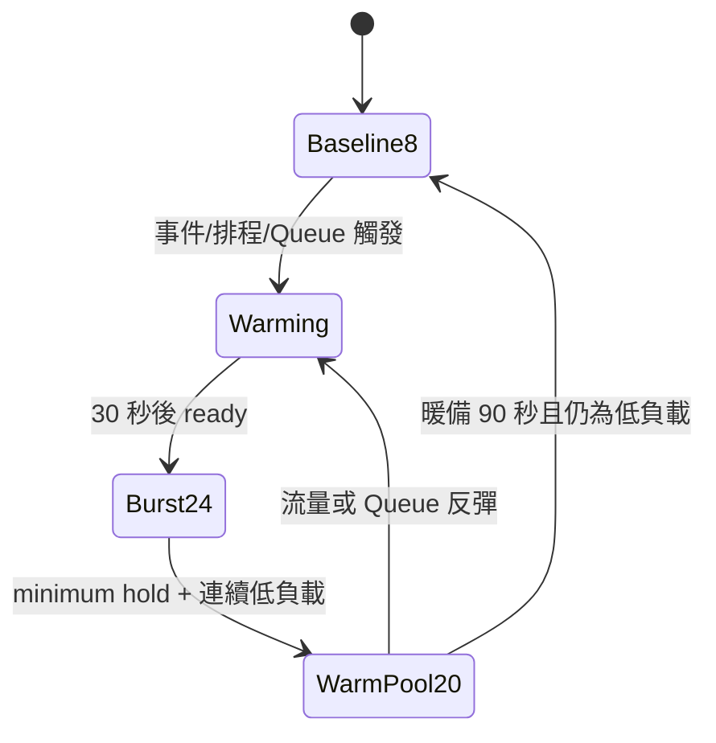
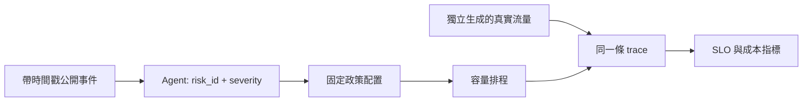

# 同預算事件驅動容量實驗

## 要驗證的命題

OpeningGuard AI 要驗證的不是「24 個 worker 一定比 12 個好」，而是：

> 在相同 720 worker-minutes 上限內，若公開事件足夠早地指出尖峰時段，平時保留 8 個 worker、短時間提高到 24 個，是否比整小時固定 12 個更能讓原始下單請求在 2 秒 SLO 內完成。

這是合成機制實驗，不是券商真實流量預測證據。只有跑完 held-out seeds，並呈現信賴區間後，才能對合成設定下的結果下結論。

## 公平成本

觀察期是一小時：

```text
固定策略：12 × 60 = 720 worker-minutes
動態策略：實際 worker-minutes ≤ 720 worker-minutes
```

720 是所有策略共同的成本上限，不是要求事件策略把預算花完。24 個 worker 從收到擴容命令起就開始計費；其中 30 秒 warmup 尚未提供完整容量，但仍計入成本。流量提早下降時，事件策略可縮容並少花預算，因此報告必須同時列出成本上限與實際 `worker_minutes`，不能再說兩者實際花費必然相同。

`normal_idle_worker_equivalent_minutes` 是以未使用的理論吞吐量換算出的 worker-equivalent time，不是 CPU 監控值。相同總容量且完成工作相同時，整小時總閒置不會憑空減少；本實驗主要比較「正常時段閒置分布」與「尖峰時段 SLO」，而不是承諾總閒置一定下降。

## 動態縮容機制



第一階段不會看到流量下降就直接從 24 降到 8。控制器採用以下固定合成參數：

- 24 workers ready 後至少維持 120 秒。
- 使用最近 15 秒觀察窗；利用率不高於 55% 且 Queue 不超過 100，必須連續成立 60 秒才可縮容。
- 先降到 20-worker warm pool 並維持至少 90 秒，再次確認低負載才降到 8。
- 利用率達 85% 或 Queue 達 300 時重新擴容。55%／85% 的雙門檻形成 hysteresis，避免反覆 scale up/down。
- 20 workers 的合成有效容量約為 `20 × 80 = 1,600 RPS`，可先承接目前 1,500 RPS 標準尖峰；被關閉的 4 workers 仍須經過 30 秒 warmup 才能重新 ready。
- 控制器只使用過去的 arrivals、Queue 和 ready capacity，不可讀取未來 peak 結束時間。
- 如果成本上限即將耗盡，系統回傳 `budget_exhausted_warning=true`；這代表此政策在限制下不可持續，不能把強制降載包裝成安全縮容。

輸出額外包含 `scale_down_first_step_seconds`、`scale_down_base_seconds`、`rebound_scale_up_count`、`budget_exhausted_warning`、`event_signal_applied`、`queue_fallback_trigger_count`、`first_scale_trigger` 與每秒 `controller_state`，供 Notebook 說明何時及為何擴縮容。

## 資訊與真值的隔離

流程分成兩條資料線：



- `generate_truth` 不接收 Agent decision，因此 Agent 判錯也不能改寫考題。
- Agent 只能看到 `published_at`、`available_at`、`expected_start`、來源與營運備註。
- Agent 只能選固定目錄中的 `risk_id` 和 `severity`，不能產生 RPS、倍率、worker 或擴容秒數。
- 數值政策來自版本化的 `event_budget_v3.json`。
- `fixture_NOT_LLM` 只用於測試事件管線，不得當作 Agent 準確率。
- 真正 OpenAI 路徑會記錄實際 API 耗時。
- confirmed 結果可直接進入固定容量政策；`uncertain` 只能顯示 high 最壞預覽，不直接執行。

## 比較策略

| 策略 | 可用資訊 | 行為 | 定位 |
|---|---|---|---|
| `fixed12` | 不需訊號 | 全程 12 | 成本相同基準 |
| `scheduled` | 已知 09:00 開盤 | 固定開盤前預熱；之後使用共同縮容控制器 | 券商場景的強基準 |
| `reactive` | 只能看到過去 Queue | 達門檻後開始 warmup；之後使用共同縮容控制器 | 一般 autoscaling 近似 |
| `event` | 當時已公開事件、時間戳，以及過去 Queue | Agent 提前訊號優先；沒有訊號時由 Queue 反應式擴容保底；之後使用共同縮容控制器 | 專案方法 |
| `perfect_timing` | 真實尖峰開始時間 | 尖峰前剛好預熱；之後使用共同縮容控制器 | 特權時間參考，不宣稱是全域最佳 oracle |

所有策略在同一個 case、同一 seed 共用同一條 Poisson 到達 trace。動態策略共享相同成本上限與縮容規則；觸發時間和可使用的資訊不同，縮容規則不因策略而偏袒。

## 測試案例

| case | 用途 | 預期暴露的問題 |
|---|---|---|
| `normal` | 沒有尖峰也沒有訊號 | 固定 12 的正常期閒置較高 |
| `early_signal` | 訊號早到且時段正確 | 事件策略能否及時 ready |
| `off_schedule` | 尖峰不在固定開盤時點 | 事件資訊相對定時策略的增量價值 |
| `false_alarm` | 有 high 訊號但沒有尖峰 | 事件策略浪費預算的代價 |
| `missed_signal` | 有尖峰但沒有事件 | Agent 系統的漏報風險 |
| `late_signal` | 訊號晚於可完整預熱時間 | Agent 判斷與 warmup 延遲 |
| `long_peak` | 尖峰超過 15 分鐘 | 同預算 pulse 無法覆蓋全程 |
| `downstream_limit` | DB／閘道上限為 1,200 RPS | worker 增加到 24 仍被下游限制 |

`early_signal` 不足以單獨證明專案比較好；誤報、漏報和晚報必須一起呈現。

## 模型與主指標

- 時間步長：100 ms cohort。
- worker 有效吞吐：`concurrency slots ÷ 平均服務時間 × efficiency = 20 ÷ 0.2 × 0.8 = 80 RPS/worker`。
- worker-only arm：DB 與 gateway 皆設 2,000 RPS，讓 24 workers 的 1,920 RPS 不被下游遮蔽。
- downstream arm：硬上限改為 1,200 RPS，用來證明增加 worker 不是萬靈丹。
- baseline / peak：500 / 1,500 RPS，全部標示為 Synthetic Demo Assumption。
- Queue：單一 FIFO，容量 12,000；此新版同預算實驗先不加入 retry，以免把「預熱價值」和「重試放大」混在同一主實驗。
- 最小服務時間：0.2 秒；除了吞吐能力，也會限制請求最早完成時點。
- 主指標：所有原始請求中在 2 秒內完成的比例。Queue drop、完成太晚與觀察期末未完成都算失敗。
- `p95_completed_only_seconds` 只對已完成請求計算，因此不能單獨使用；必須和失敗率一起報。
- `bad_run`：單日 SLO failure rate 大於 0.1%。

統計單位是獨立模擬日，不是每一筆訂單。壞日機率使用 Wilson 95% interval；策略差異使用同 case、同 seed 的 day-level paired bootstrap interval。

### Agent 介入與成功解救

- `Agent 介入`：事件訊號實際觸發預熱，不只是在輸入中出現。
- `介入後通過 SLO`：Agent 已介入，且 Event 策略該日不是 `bad_run`。
- `相對 reactive 成功解救`：同一 case、同一 seed 下，Agent 已介入、Event 通過 SLO，但 reactive 是 `bad_run`。
- `相對 scheduled 成功解救`：同一 case、同一 seed 下，Agent 已介入、Event 通過 SLO，但 scheduled 是 `bad_run`。
- `介入但仍失敗`、`Queue 保底觸發` 與 `誤報介入` 另外計數，避免只報對專案有利的數字。

這些是配對模擬的機制指標，不等於真實 LLM 的救援能力。使用 `fixture_NOT_LLM` 時只能證明事件訊號成功進入政策；OpenAI Agent 的分類效果仍需以獨立 held-out 人工標註資料評測。

## 實驗程序

1. 先用 `tuning_seeds` 檢查程式與選擇事先規則。
2. 規則凍結後，使用完全不同的 `evaluation_seeds` 跑主實驗。
3. 每個 case × seed 只生成一次 truth trace，重放給五個策略。
4. 先報固定 12、定時策略與反應式，再報事件策略；不能省略強基準。
5. 報 SLO 成功率、壞日機率 CI、Queue、worker-minutes、正常／尖峰時段 idle、ready lead time、縮容時間、反彈次數、Agent 介入／成功解救次數與下游／預算警告。
6. 另外掃描尖峰 RPS、持續時間與訊號 lead time，揭露方法在哪些區域有效或失敗。
7. 不因結果不好而換 held-out seeds 或刪除 case。

Notebook 的 `RUN_LLM=False`，所以重新執行主實驗不會誤觸付費 API。主實驗與敏感度仍由 `RUN_EXPERIMENTS`、`RUN_SENSITIVITY` 分開控制；每個 code cell 前都有 Markdown 說明。

## 評審面前能說的話

若結果支持，可說：

> 在我們事先公開的合成參數、同一小時 720 worker-minutes 上限與 held-out Monte Carlo days 下，事件驅動策略把容量移到尖峰前，改善了原始訂單的 2 秒 SLO；效果及不確定性如信賴區間所示。

仍不能說：

- Agent 已能預測真實券商事故。
- 14 筆歷史新聞證明事件一定先於流量。
- fixture 結果就是 OpenAI Agent 準確率。
- `perfect_timing` 是已證明的最佳策略。
- 合成的 500／1,500 RPS、80 RPS/worker 或 30 秒 warmup 是業界通用常數。

## 尚未完成的證據

- 真實新聞／行情的自動收集、去重、時間戳保存與重播。
- 將 14 筆事故補成「訊號發生時間、服務尖峰時間、是否可事前取得」的前瞻資料；目前只有回顧式候選。
- 若未來升級為論文級 gold labels，再補第二位人工標註者、盲標裁決及標註者間一致性；本版不要求。
- 有 API key 的三 judge 真實延遲、成本與 held-out Agent 分類評測。
- 真實 worker、DB、gateway、warmup 與服務時間分布校準。
- 同一小時多個獨立事件、跨事件冷卻政策，以及縮容門檻與持有時間的資料驅動最佳化。
- retries 與 idempotency 的獨立 ablation。
